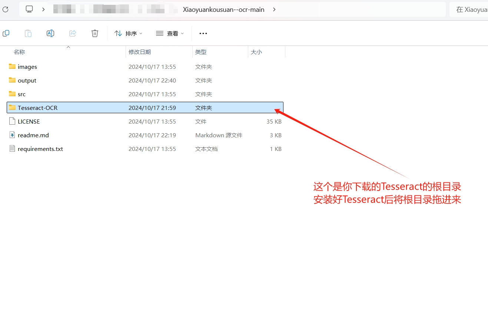
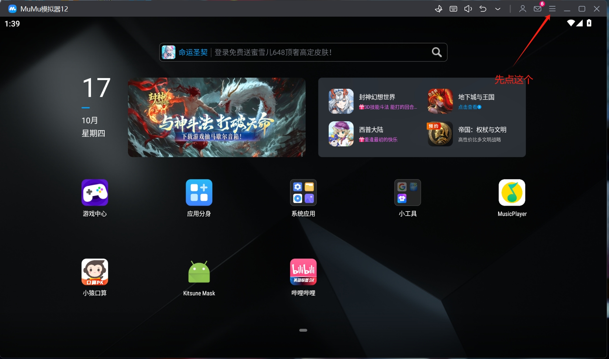
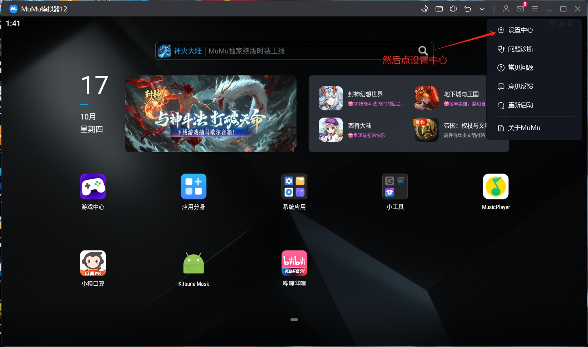
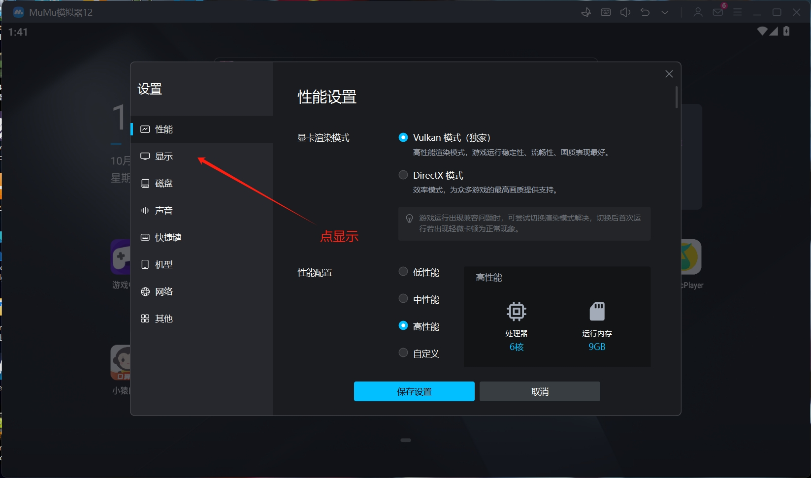
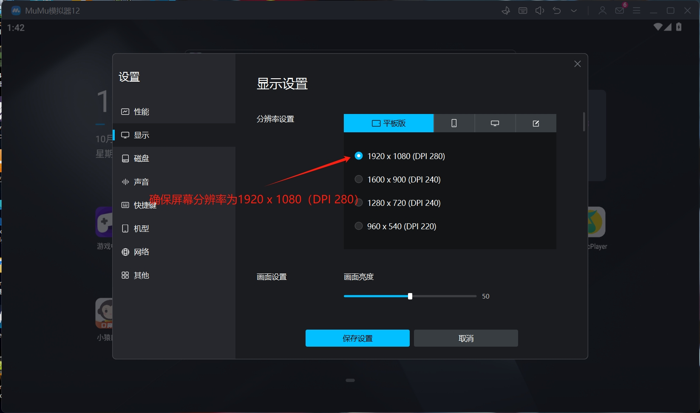
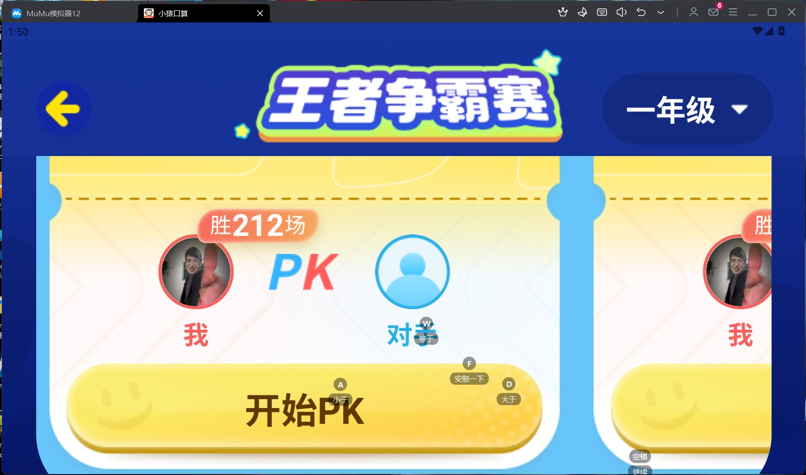

# 基于python的小猿口算自动答题工具

## 1. 项目简介

本项目是一个基于python的小猿口算自动答题工具,使用最为稳定的tesseract文本识别(OCR)引擎（未使用抓包工具，虽然其速度快，但好像已经被官方修复了^^）,通过截图识别题目，然后比较数字的大小，自动输出答案，并自动进行下一局游戏。

## 2. 开始上手

### 2.1 安装模拟器以及小猿口算

* 本脚本使用了**MuMu模拟器12**：[MuMu模拟器12](https://mumu.163.com/)
* 以及小猿口算的apk，可在浏览器搜索**小猿口算apk**关键字下载，下载完成后只需将其拖入模拟器即可自动安装。

### 2.15 如果你对python并不感兴趣，但又想AI炸鱼，可以试试下载Release版本的小猿口算-ocr，下载地址：https://github.com/MinerTob/Xiaoyuankousuan--ocr/releases
安装后先运行MUMU模拟器，然后打开小猿口算，接着再运行小猿口算-ocr，这样即使你是编程小白，也可以轻松上手。

### 2.2 安装python环境（非直装版用户或想了解项目内核的码农看过来）

1. 本项目采用了python3.12.5开发，建议安装python3.12.5及以上版本。
2. 本项目使用了tesseract文本识别(OCR)引擎，需要下载tesseract-ocr-w64-setup-v5.0.0-alpha.20210506.exe安装包，下载地址：[tesseract-ocr-w64-setup-v5.0.0-alpha.20210506.exe](https://digi.bib.uni-mannheim.de/tesseract/tesseract-ocr-w64-setup-v5.0.0-alpha.20210506.exe)。注意下载完成后还需要修改**环境变量**，将tesseract的安装路径添加到系统环境变量中。
3. 将本代码库下载到本地，使用命令行进入到代码库的根目录，执行以下命令安装依赖：

    ```shell
    pip install -r requirements.txt
    ```

4. 安装完成后，把Tesseract-OCR文件夹拖动到根目录下，如图所示：
    

### 2.3 运行代码

1. 打开MuMu模拟器，**注意按照图片设置屏幕分辨率**。
    
    
    
    
2. 启动小猿口算，进入到答题界面。
    
3. 使用命令行进入到代码库的根目录，执行以下命令：

    ```shell
    python ./src/main.py
    ```

4. 等待程序运行，程序会自动识别题目，然后比较数字的大小，自动画出答案,另外还会自动进行下一局游戏。
# 小猿口算-ocr
